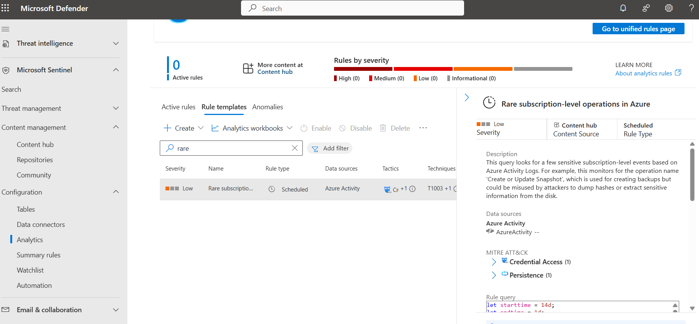
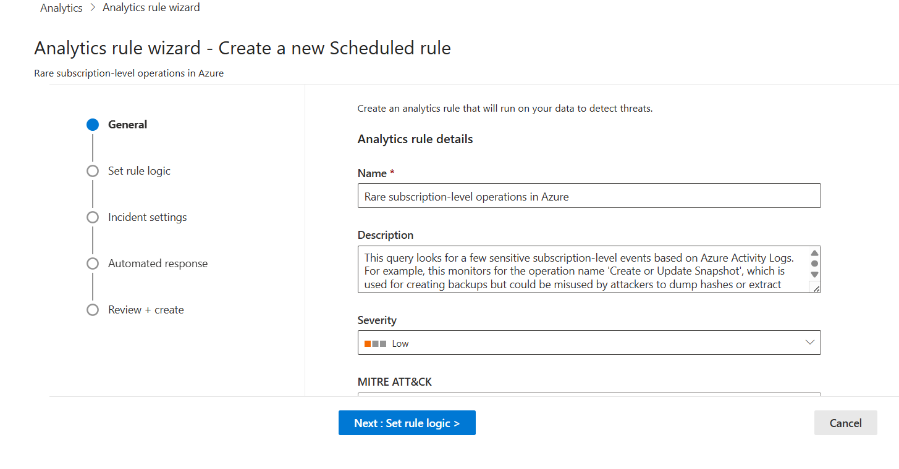
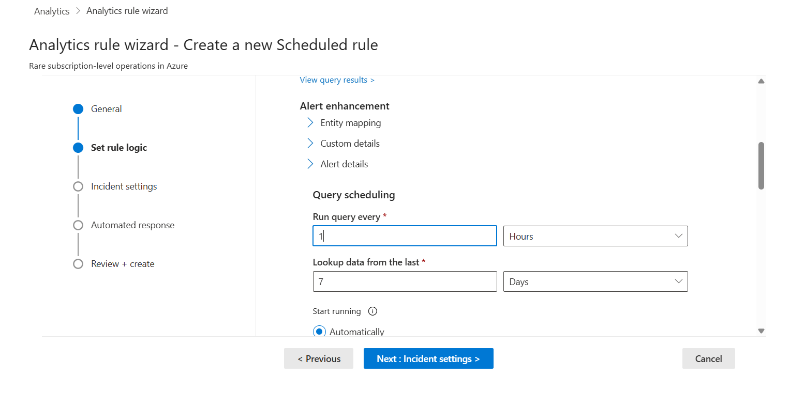
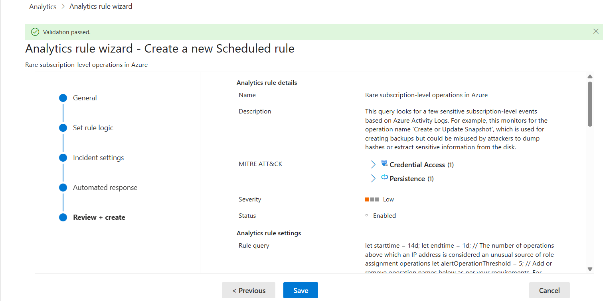
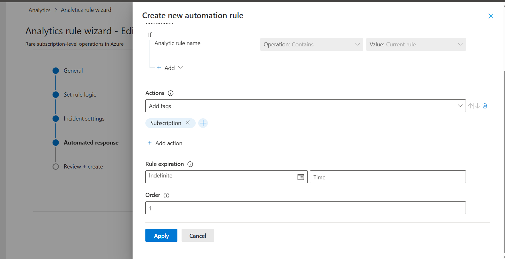
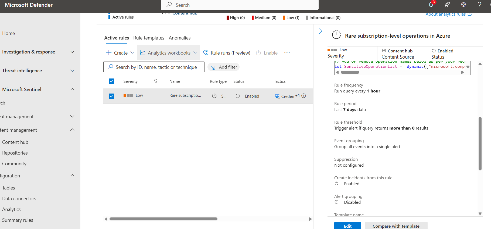

# Creating Analytics Rules in Microsoft Sentinel

- Browsing built-in Sentinel rule templates
- Creating a new Analytics rule via the wizard
- Configuring rule logic, scheduling, and incident settings
- Adding automation responses
- Reviewing and enabling the rule

# Screenshots

