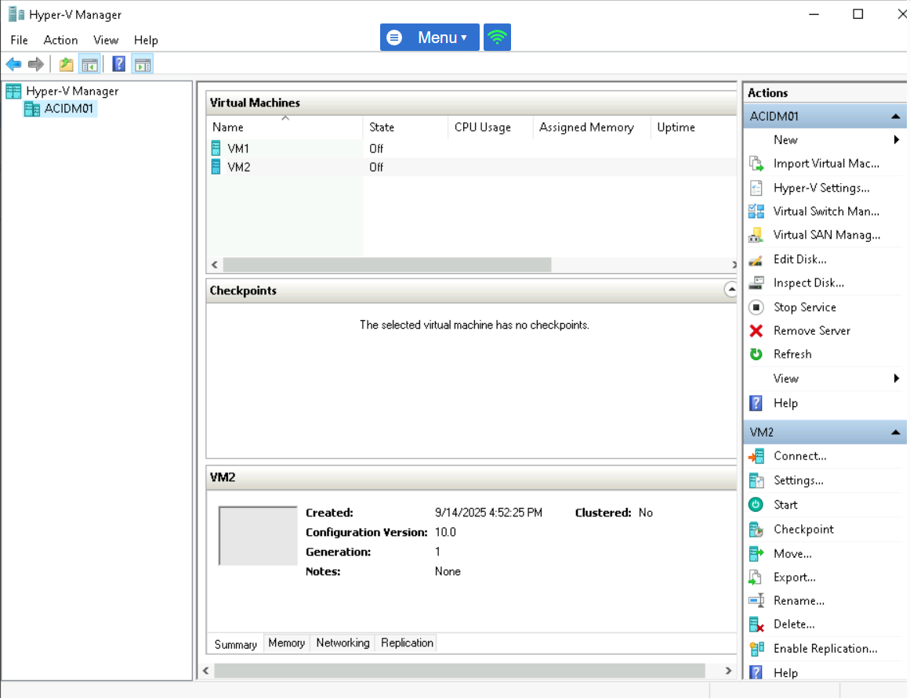

# Hyper-VLAN Lab
Set up two TinyCore Linux VMs on Hyper-V, place their virtual NICs on VLANs, and test
basic connectivity. 

** You will see **

- Creating Generation 1 VMs on Hyper-V
- Attaching a bootable ISO
- Setting a Port VLAN ID on a Hyper-V virtual NIC
- Assigning static IPs in TinyCore Linux
- Verifying connectivity with 'ping'

## Topology

- **Host:** Windows with Hyper-V enabled
- **Virtual Switch:** 'Mod9Switch' (External or Internal)
- **VMs:** 'VM1' and 'VM2' (1 vCPU, 1024 MB)
- **Guest OS:** TinyCore Linux (Core-current.iso_
- **IP Plan (example):**
- 'VM1' - '10.0.0.10/24'
- 'VM2' - '10.0.0.20/24'

## Screenshots

