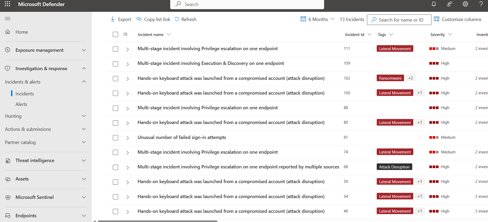

# Investigating Multi-Stage Incidents in Microsoft Defender XDR
A quick demo of **incident triage and investigation** in Microsoft Defender XDR — covering correlated alerts, lateral movement, and automated containment.

## 🎯 Objectives
- Analyze **multi-stage incidents** from compromised accounts  
- Review correlated **alerts**, **process trees**, and **assets**  
- Observe **automated attack disruption** actions  

## 🧠 Summary
Defender XDR detected a **hands-on keyboard attack** launched from a compromised account (`thomaspc`).  
The system identified suspicious **PowerShell** and **cmd.exe** activity, **RDP registry modification attempts**, and **lateral movement** behavior.  
Automated response isolated one compromised account and blocked registry edits linked to Remote Desktop configuration changes.

## ⚙️ Key Findings
- 50 correlated alerts, most rated **High severity**  
- Malicious command lines executed via elevated processes  
- Registry modifications targeting `HKLM\System\CurrentControlSet\Control\Lsa`  
- Affected user: **kevin (Local admin)** on **Windows 11** workstation  
- Device and user both contained by automated response

## Screenshots

