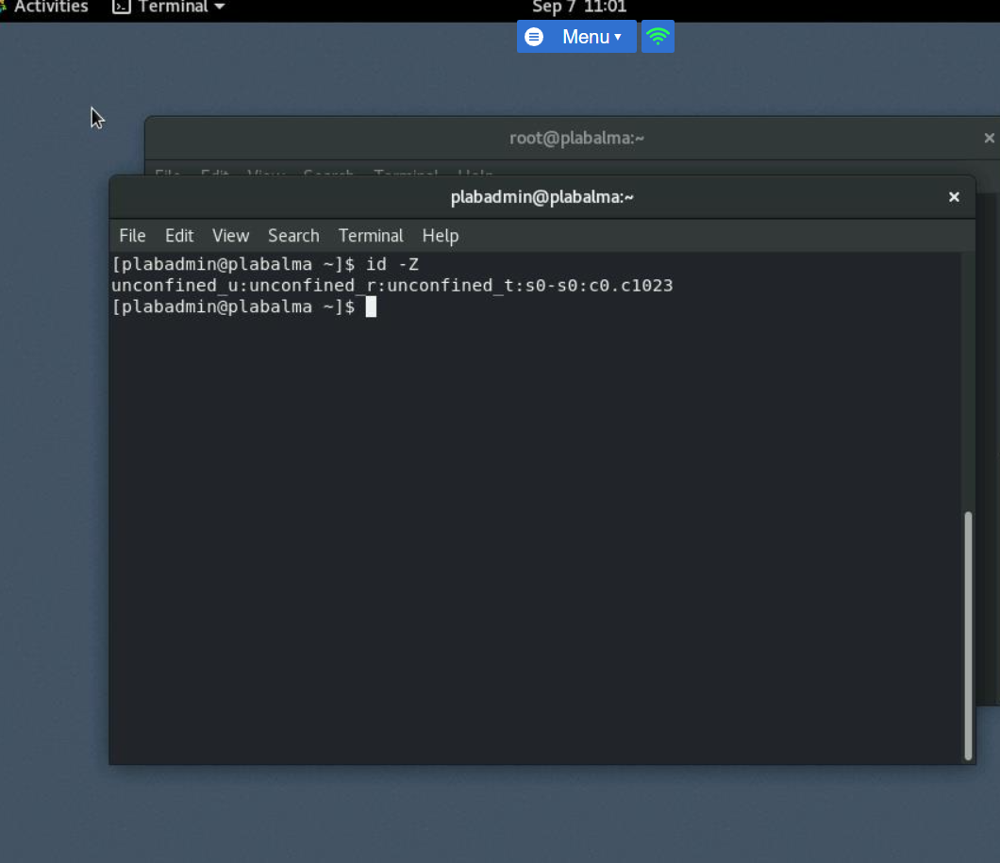

# Linux Administration (SELinux & Root Management)

## Overview
This project demonstrates administrative tasks in Linux, with a focus on **SELinux security policies**.  
It includes enabling/disabling enforcement, inspecting SELinux contexts, and managing permissions.

## Skills Demonstrated
- Switching to root and handling authentication
- SELinux modes: enforcing, permissive, disabled
- Using `getenforce`, `sestatus`, `setenforce`
- Editing `/etc/selinux/config`
- File labeling with SELinux contexts
- Checking security contexts of executables (`ls -Z`)
- Managing SELinux users (`semanage login`)

## Screenshots

