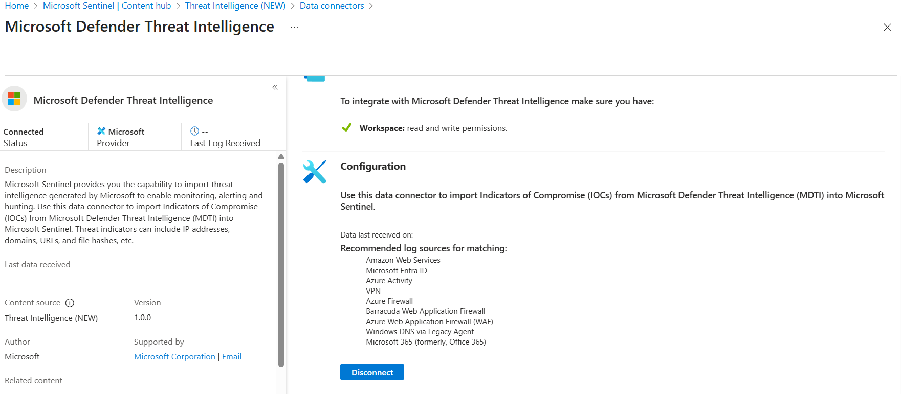
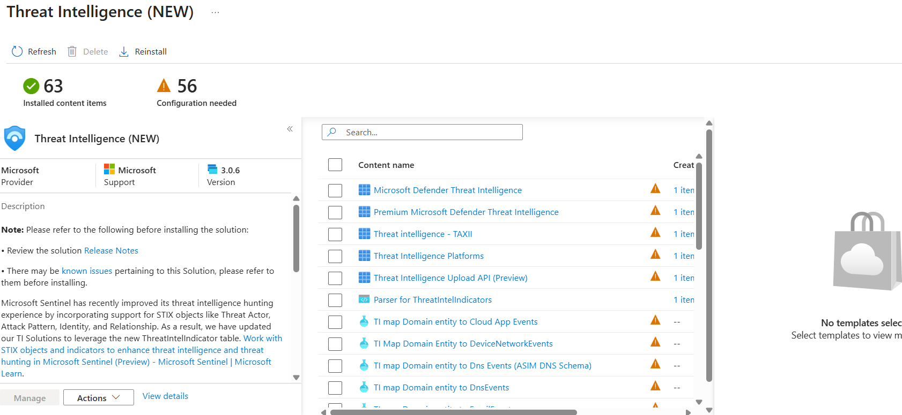
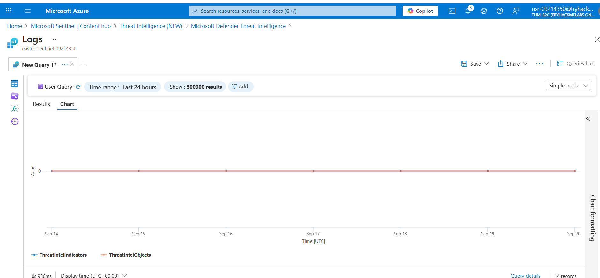

# Integrating Microsoft Defender Threat Intelligence with Microsoft Sentinel

Demonstrating how to connect Microsoft Defender Threat Intelligence (MDTI) into Microsoft Sentinel and leverage the Threat Intelligence 
(NEW) Content Hub solution. Exploring data connector setup, installed content, and querying IOC data in Log Analytics.

- Connecting the Microsoft Defender Threat Intelligence data connector
- Reviewing recommended log sources for IOC matching (Azure, AWS, M365, VPN, DNS, Firewalls)
- Installing and configuring the Threat Intelligence (NEW) Content Hub solution
- Exploring installed content: connectors, STIX/TAXII support, hunting queries, mappings

# Screenshots

