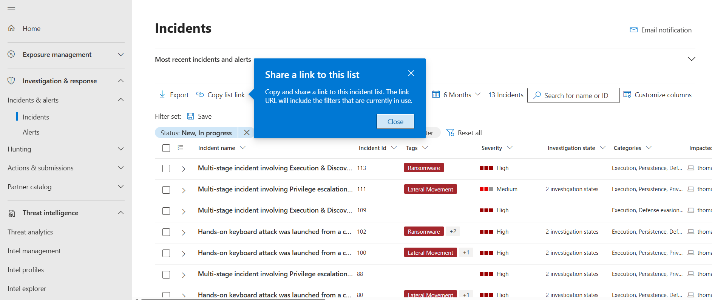
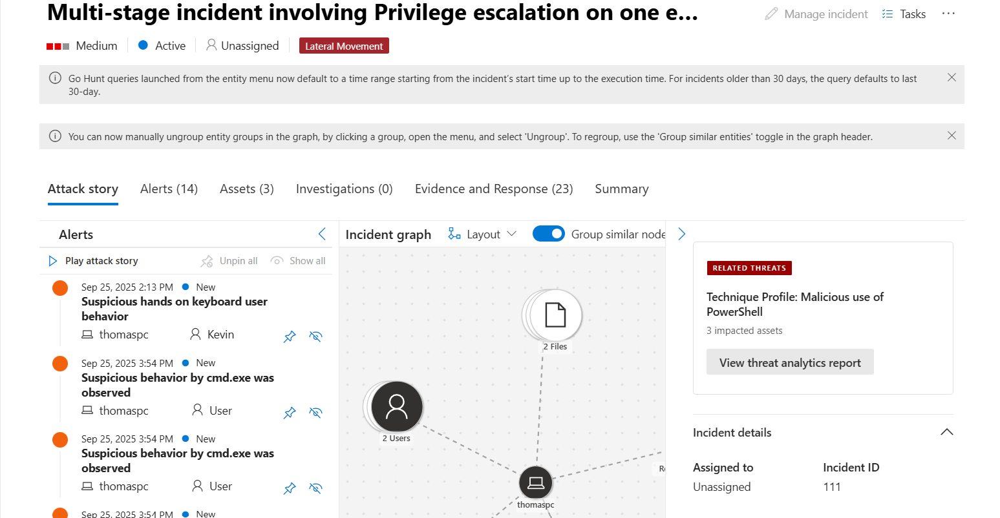
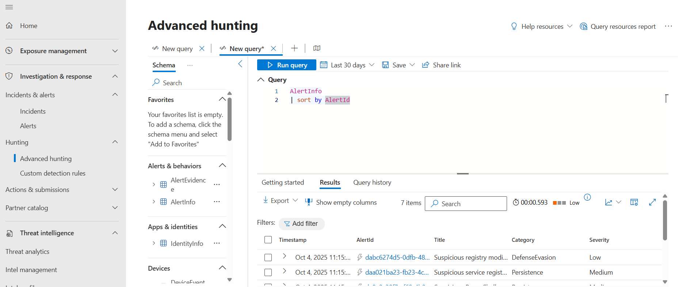
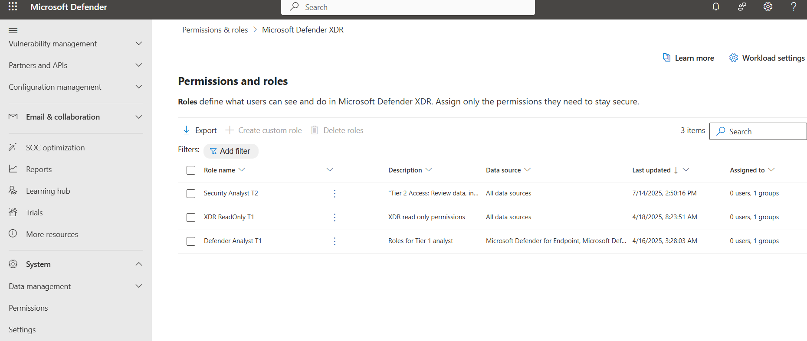
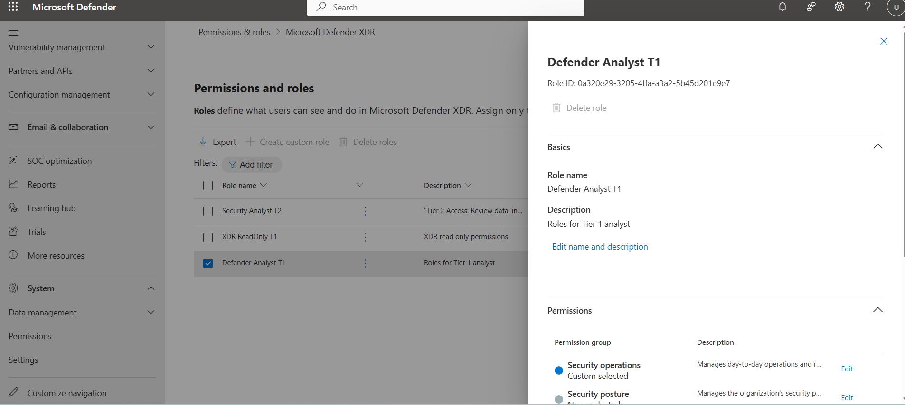

# Investigating Multi-Stage Incidents in Microsoft Defender XDR

Demonstrating incident analysis and role management in **Microsoft Defender XDR** — covering incident triage, alert correlation, advanced hunting, and analyst role permissions.

## Objectives
- View and filter incidents by **status** and **severity**  
- Analyze correlated alerts, assets, and related threats  
- Use **Advanced Hunting (KQL)** for deeper investigation  
- Manage **RBAC roles** for Tier 1 and Tier 2 analysts  

## Screenshots

