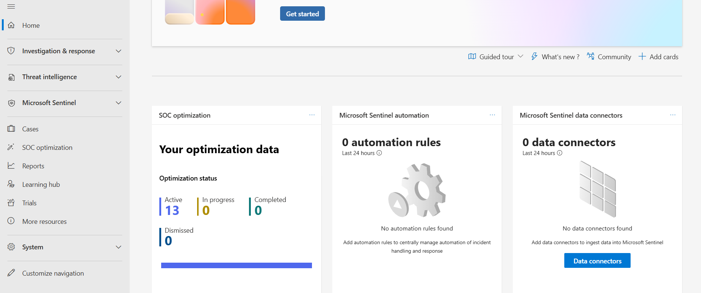
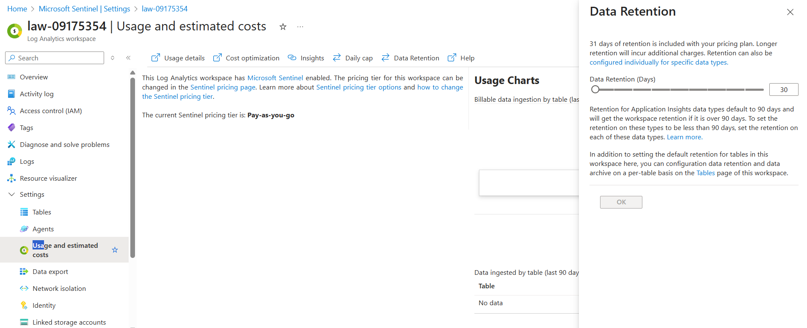
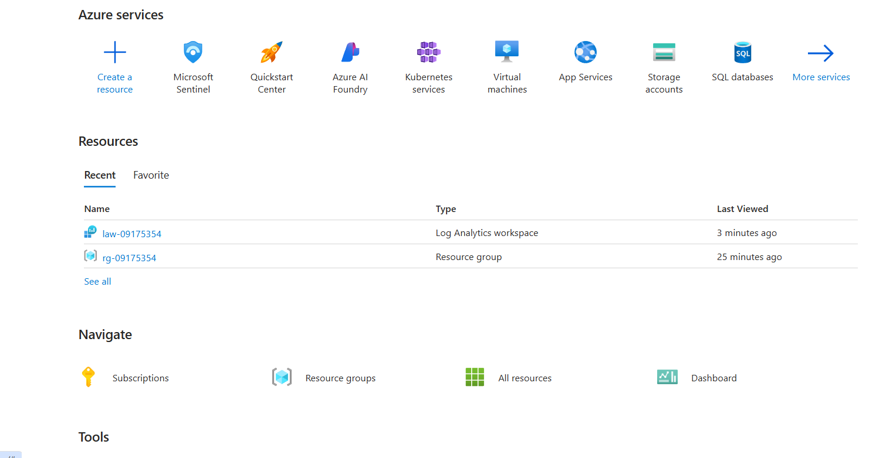

# Deploying Microsoft Sentinel with Log Analytics Workspace

Demonstrating deploying Microsoft Sentinel and attach it to a Log Anaytics Workspace in Azure. 
Checking basic optimization and retention settings.

- Creating a Log Analytics Workspace
- Enabling Microsoft Sentinel
- Exploring Sentinel's optimization and automation dashboards
- Viewing usage and retention policies in LAW

  ## Screenshots

