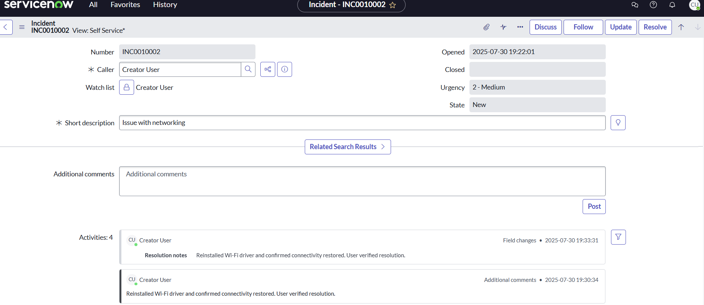
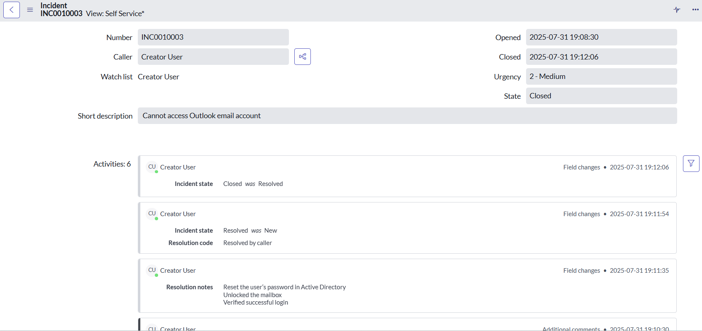
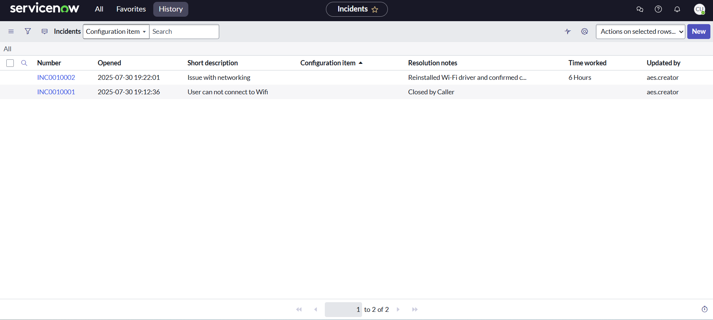

Name: Ticketing System

About: Showcases incident management workflows in ServiceNow. The 
focus is on handling real IT support cases such as email access, networking, and 
Wi-Fi issues

## Task
- [ ] Creating, updating, and resolving incidents
- [ ] Writing clear resolution notes
- [ ] Managing ticket states

## Screenshots

