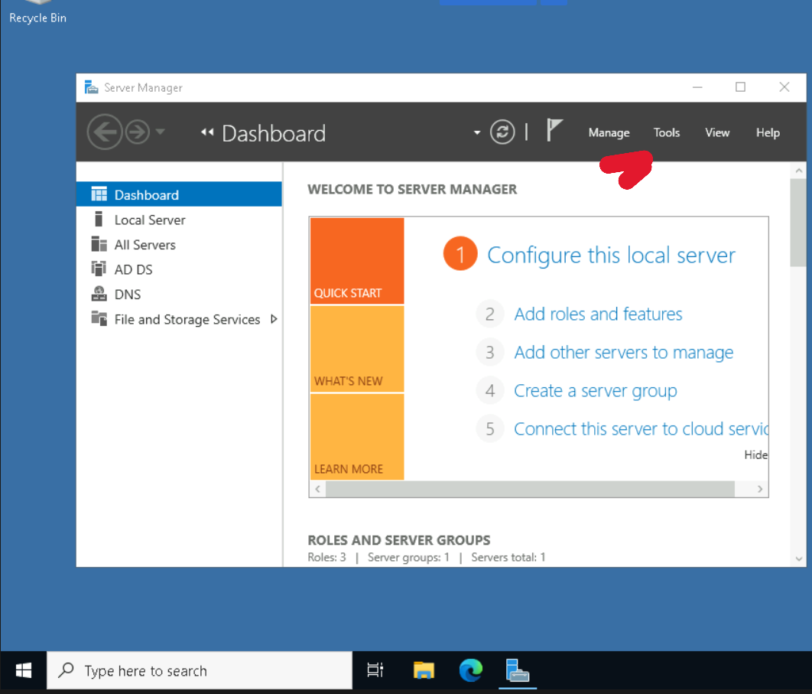
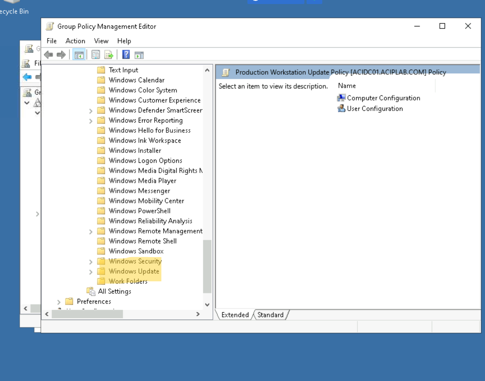
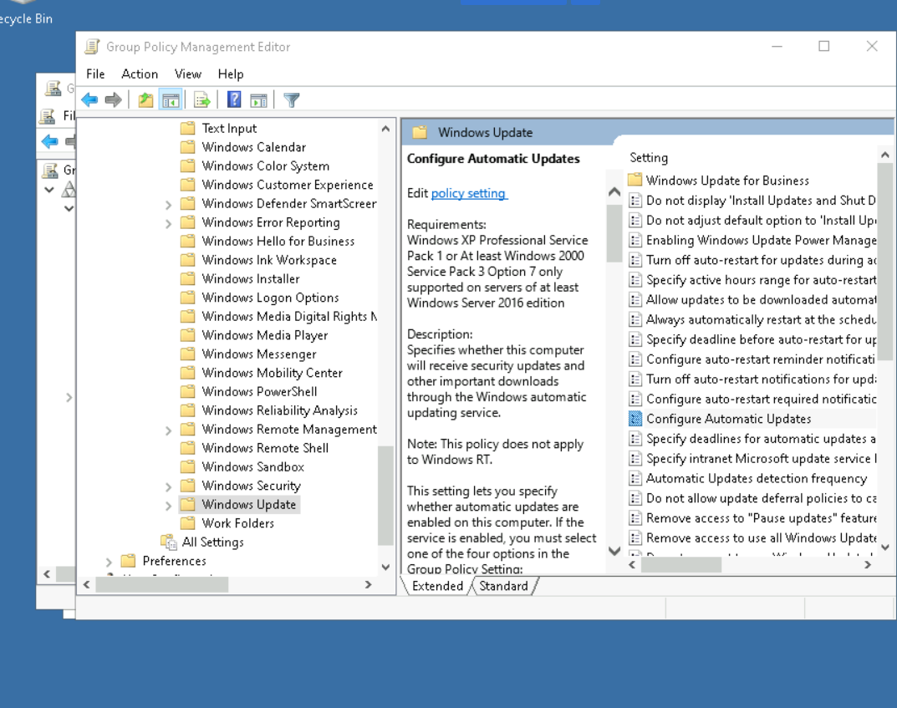
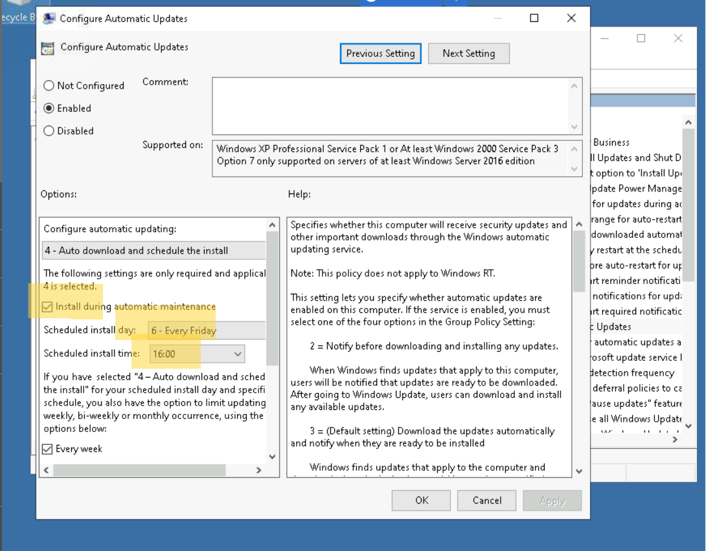

# Windows Group Policy Management

## Overview
This lab focuses on managing enterprise-level policies using **Group Policy Management Editor (GPO)**.  
It highlights how Windows Update configurations are applied across the domain.

## Skills Demonstrated
- Navigating and editing Group Policy Objects (GPOs)
- Enforcing automatic updates and install schedules
- Restricting user ability to pause or defer updates
- Ensuring compliance with security patching policies

## Screenshots

